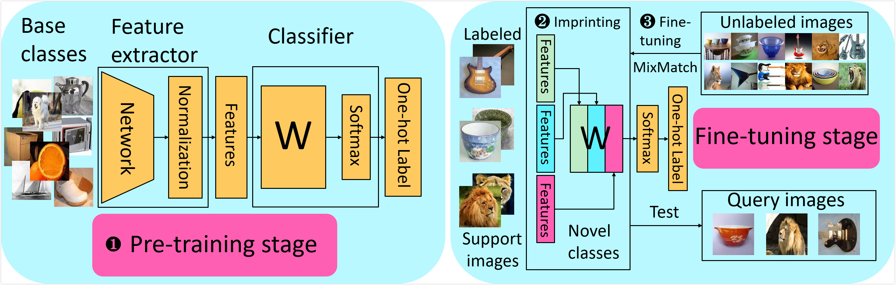

# TransMatch: a transfer learning scheme for semi-supervised few-shot learning

Zhongjie Yu<sup>1</sup>, Lin Chen<sup>2</sup>, Zhongwei Cheng<sup>3</sup>, Jiebo Luo<sup>4</sup>

<sup>1</sup>University of Wisconsin-Madison

<sup>2</sup>

<sup>3</sup>
  
<sup>4</sup>University of Rochester
  
  
# Abstract

The successful application of deep learning to many visual recognition tasks relies heavily on the availability of a large amount of labeled data which is usually expensive to obtain. The few-shot learning problem has attracted increasing attention from researchers for building a robust model upon only a few labeled samples. Most existing works tackle this problem under the meta-learning framework by mimicking the few-shot learning task with an episodic training strategy. In this paper, we propose a new transfer-learning framework for semi-supervised few-shot learning to fully utilize the auxiliary information from labeled base-class data and unlabeled novel-class data. The framework consists of three components: 1) pre-training a feature extractor on base-class data; 2) using the feature extractor to initialize the classifier weights for the novel classes; and 3) further updating the model with a semi-supervised learning method. Under the proposed framework, we develop a novel method for semi-supervised few-shot learning called TransMatch by instantiating the three components with Imprinting and MixMatch. Extensive experiments on two popular benchmark datasets for few-shot learning, CUB-200-2011 and miniImageNet, demonstrate that our proposed method can effectively utilize the auxiliary information from labeled base-class data and unlabeled novel-class data to significantly improve the accuracy of few-shot learning task.

# Semi-supervised few-shot learning framework

<p align="center"></p>
### Markdown

Markdown is a lightweight and easy-to-use syntax for styling your writing. It includes conventions for

```markdown
Syntax highlighted code block

# Header 1
## Header 2
### Header 3

- Bulleted
- List

1. Numbered
2. List

**Bold** and _Italic_ and `Code` text

[Link](url) and 
```

For more details see [GitHub Flavored Markdown](https://guides.github.com/features/mastering-markdown/).

### Jekyll Themes

Your Pages site will use the layout and styles from the Jekyll theme you have selected in your [repository settings](https://github.com/yzjdsly/TransMatch/settings). The name of this theme is saved in the Jekyll `_config.yml` configuration file.

### Support or Contact

Having trouble with Pages? Check out our [documentation](https://help.github.com/categories/github-pages-basics/) or [contact support](https://github.com/contact) and we’ll help you sort it out.
