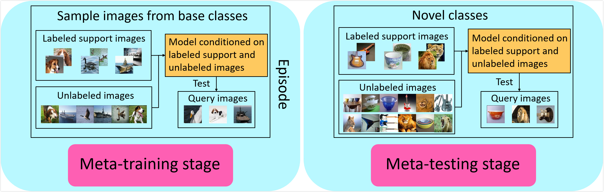
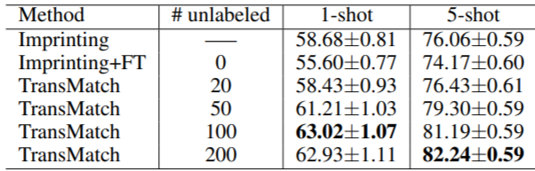
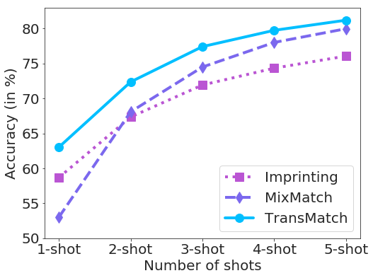
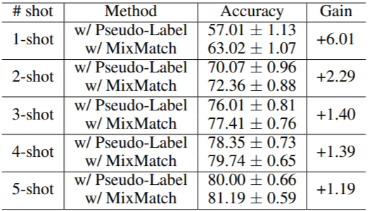
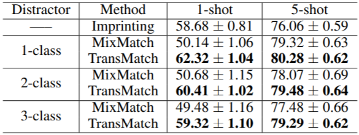
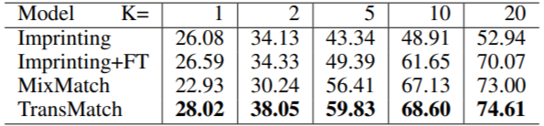
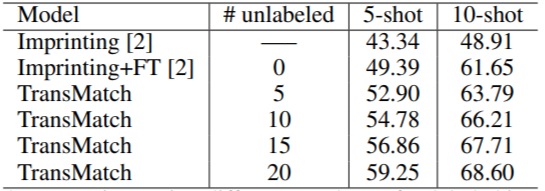

# TransMatch: a transfer learning scheme for semi-supervised few-shot learning

Zhongjie Yu<sup>1</sup>, Lin Chen<sup>2</sup>, Zhongwei Cheng<sup>3</sup>, Jiebo Luo<sup>4</sup>

<sup>1</sup>University of Wisconsin-Madison

<sup>2</sup>

<sup>3</sup>
  
<sup>4</sup>University of Rochester
  
Full paper: [Link](url)  
# Abstract

The successful application of deep learning to many visual recognition tasks relies heavily on the availability of a large amount of labeled data which is usually expensive to obtain. The few-shot learning problem has attracted increasing attention from researchers for building a robust model upon only a few labeled samples. Most existing works tackle this problem under the meta-learning framework by mimicking the few-shot learning task with an episodic training strategy. In this paper, we propose a new transfer-learning framework for semi-supervised few-shot learning to fully utilize the auxiliary information from labeled base-class data and unlabeled novel-class data. The framework consists of three components: 1) pre-training a feature extractor on base-class data; 2) using the feature extractor to initialize the classifier weights for the novel classes; and 3) further updating the model with a semi-supervised learning method. Under the proposed framework, we develop a novel method for semi-supervised few-shot learning called TransMatch by instantiating the three components with Imprinting and MixMatch. Extensive experiments on two popular benchmark datasets for few-shot learning, CUB-200-2011 and miniImageNet, demonstrate that our proposed method can effectively utilize the auxiliary information from labeled base-class data and unlabeled novel-class data to significantly improve the accuracy of few-shot learning task.

# Semi-supervised few-shot learning framework
<p align="center"></p>

<p align="center"></p>

The overall architecture of our model.

### Pre-train feature extractor
We pre-train a base network on all examples in base classes
### Classifer weight imprinting
We apply the feature extractor to imprint the novel classifier based on few labeled samples.
### Semi-supervised fine-tuning by MixMatch.
We adopt the holisitc semi-supervised method MixMatch to fine-tune the novel classifier on few labeled samples and many unlabeled samples.

# Results

#### Accuracy (in %) with different number of unlabeled images on miniImagenet
<p align="center"></p>


#### Comparison of Imprinting, MixMatch and our TransMatch for 5-way classification with different number of shots on miniImagenet
<p align="center"></p>


#### Comparison of using Pseudo-Label and MixMatch in the semi-supervised fine-tuning part on miniImagenet
<p align="center"></p>


#### Accuracy (in %) of MixMatch and TransMatch with different number of distractor classes on miniImagenet
<p align="center"></p>


#### Accuray (in %) comparison on CUB-200-2011
<p align="center"></p>


#### Accuray (in %) comparison with different number of unlabeled images on CUB-200-2011
<p align="center"></p>


# Code

[Link](https://github.com/yzjdsly/TransMatch_code)  

# Cite
Please cite our paper if it is helpful to your work:

```
@inproceedings{li2019lst,
  title={XXX},
  author = {XXX},
  booktitle={XXXX},
  year={2020}
}
```


**Bold** and _Italic_ and `Code` text

